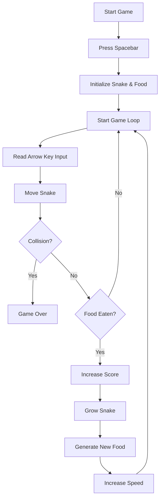

# Snake-game
A browser-based Snake Game built using HTML, CSS, and vanilla JavaScript with responsive keyboard controls, score tracking, and increasing difficulty. Implemented core game logic including snake movement, food generation, collision detection, and dynamic rendering using CSS Grid
# Project Flow

